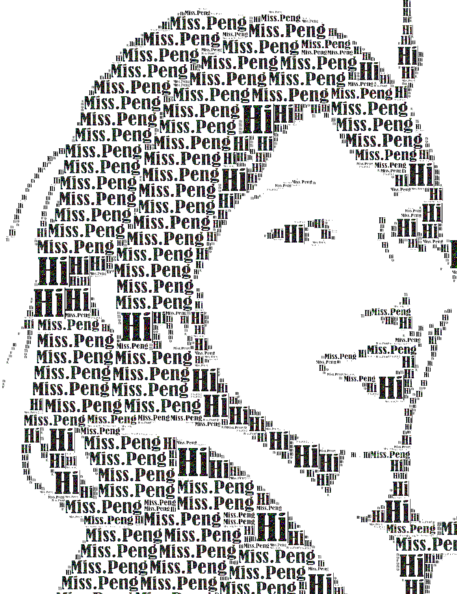
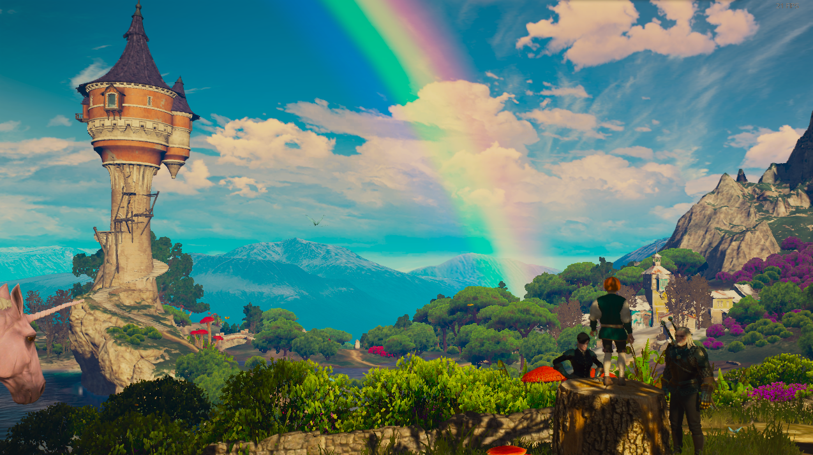
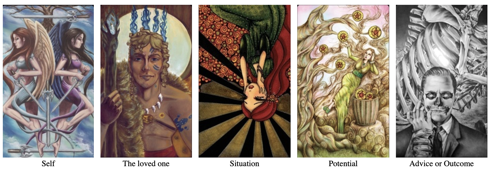

# 他

>"The day is near when your burden became gift and thy suffering will light thy path."
								——Tagore


* * *





* [ ] `Please read this file with the following BGM` [BGM](https://music.163.com/song?id=864711417&userid=367234819) 

* * *
**Welcome, your Highness.
This is a place that his heart lives in. And I will lead you to this place to travel as a guest by reading this article. Excuse me, I should announce some precautions before you walk around: This article is organized as follows.**

* SECTION I is a magical space from which you can see thy future and thy past.
* SECTION II is a battlefield, where the sword and poems fight with each other.
* The last section is an amusement place which provides a game for you.

**That's it, at your humble service, my princess.**


* * *

#### SECTION I: Alice's Dream Place 

The door is opening. Come in please. 


* [ ]`Please ask a question that you wanna to get an answear.`

He has drawed five Tarot cards for you. 




1. **Self** (5 of swords): Before you fight for something, make sure you consider the consequences. When one person seeks to dominate another, both become slaves. This card shows the end results of a battle and nobody seems to be rejoicing. The victor has won, but at what cost? He wanted to dominate and enslave his opponent and he is not happy with the outcome. This card represents a clash of wills, where even the winner does not win. It is an empty victory.
2. **The loved one** (King of wands): Solving problems and manifesting what you desire is the driving force of the King of Wands. He is not just an idea man; he puts his ideas to work. That is what you should do. You will discover that when you are feeling good, you will be more successful, and when you are feeling bad, you will prevent success from manifesting.
3. **Situation** (9 of Swords, reversed): Pay attention to your thinking and use the power of your will to direct it toward more positive pursuits that will take your mind off of worry over things that you can't do anything about. This kind of thinking will drain your energy and result in poor health.
4. **Potential** (7 of Pentacles): Stop and evaluate your progress and appreciate your accomplishments. You have come a long way, so let that inspire you to finish your journey or that project.
5. **Advice or Outcome** (Death): Embracing change will empower you and you will move forward. Resistance will only increase suffering. You can make the hard decisions yourself and have it your way or they will be made for you.

`I'm sure that he will summarize these clues for you.`
* * *

#### SECTION II: Sword & Poems 


`Here are some poems written by him. You can learn the stories behind these poems`  


>##### 《梦》
>
>雨季过后，蟋蟀等来日落。
>连接黑夜与星空的小巷，
>汇聚宴会的中央。
>风是舞者，
>穿着碎叶的裙子，
>来自四面八方。                   
>
>如果我没有猜错，
>是丁香开了。
>因为，
>我触到她们的衣角，
>嗅到细腻的芬芳。 
>
>路口
>灯谢了。
>那红色，
>终不敌绿的婀娜。
>
>片刻。
>熙攘的洪流，
>穿过仍在盛开的霓虹。
>
>让我，
>在你眼中淹没。
>\
* * *
>
>##### 《风》
>无梦之国，
>无人，
>也无烟火，
>徒留已无人能辨的语言
>牵着她的名字在雨中穿梭。
>\
* * *
>
>
>##### 《魔音》
>
>黄昏即将迎来死亡，
>像它无数先祖，
>被我慢慢埋葬。
>
>而风将它墓碑的歌轻轻弹唱
>：“昨日，昨日的一生
>是占卜师的自己的魔咒，
>化作他独自许愿的忧伤
>
>他投子入湖，询问梦境，
>——是时候一起离开？
>带着憧憬，
>离开这座孤独的国度，
>逃离这迷茫的饥荒。  ”

* * *

`He likes sword combats and always swings his great sword jumping around.`
SUCH AS...


* * *
#### SECTION III: A Little Game

>Q：一个矿泉水瓶能容纳些什么东西呢？


* * *

`How I hope the following equation could be demonstrated.`
```math
P(You~|~Me)=\sum_{k}P[\int_{Now}^{End}\oint_{Heart}\mathscr{H}_{life}(Girl_k)~|~Me],
```
```math
\text{where}~\mathscr{H}~\text{denotes happenese.}
```

